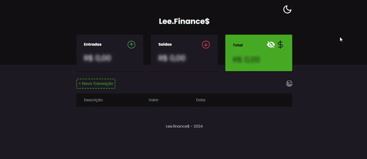
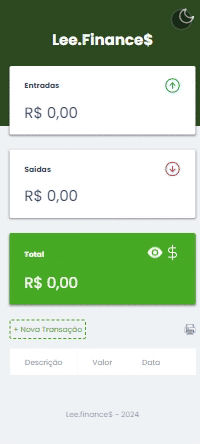

# Balanço financeiro

## Resumo

Temos um app de balanço financeiro, onde você pode adicionar um nome, um valor e uma data para  a entrada e alem disso pode também editar e excluir as entradas.

Projeto desenvolvido em um evento online.

## Tecnologias Utilizadas!

  
	
  

## Veja o funcionamento!
### Desktop

Neste gif animado você pode conferir o projeto no Desktop em pleno funcionamento.

### Mobile

Neste gif animado você pode conferir o projeto no Mobile em pleno funcionamento.

## Acesse o Projeto!

Você pode acessar o projeto através do link abaixo:

➜ [Link do Projeto](https://ezequiel-lee.github.io/Finance/)
